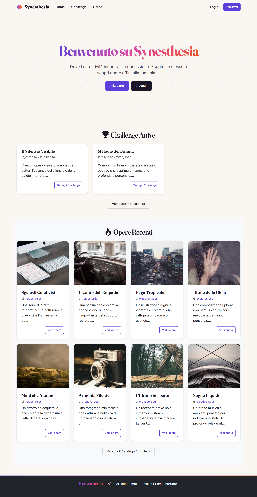

# Guida cattura screenshot per la relazione

Istruzioni passo-passo per catturare le 12 immagini da allegare al report
d'esame. Salvare tutto in `docs/screenshots/` come `.png` 1280×720 minimo.

## Prerequisiti

```bash
cd C:\Users\VGit\Desktop\synesthesia
npm start
# server su http://localhost:3000
```

Browser consigliato: Chrome o Firefox. DevTools → device toolbar → 1280×720
per uniformità.

## Sequenza di cattura

### 1. Home guest (`01-home-guest.png`)
- Aprire `http://localhost:3000` in modalità privata (no login)
- Catturare la pagina piena: hero + challenge attive + opere recenti

### 2. Registrazione (`02-register.png`)
- Cliccare "Registrati" dalla navbar
- Compilare parzialmente il form per mostrare la UI

### 3. Onboarding (`03-onboarding.png`)
- Registrarsi come `anna` / `anna@test.it` / `password`
- Andare a `/onboarding` — mostrare almeno 3 domande visibili

### 4. Profilo personale (`04-profile-own.png`)
- Completare tutte le 15 domande con risposte varie
- Sarà redirectati a `/profile/anna` con la sezione "punteggi enneagrammatici"
- Assicurarsi che il tipo dominante sia visibile con la stellina

### 5. Feed personalizzato (`05-feed.png`)
- Cliccare "Feed" nella navbar
- Catturare la pagina con task consigliate + challenge + opere affini
- Le card opere devono mostrare la `blockquote-footer` con la caption Zen

### 6. Lista challenge (`06-challenge-list.png`)
- `/challenges` — 4 card visibili (2 attive + 2 inattive)

### 7. Dettaglio challenge (`07-challenge-detail.png`)
- `/challenges/1` — "Il Silenzio Visibile"
- Mostra prompt, date, stato, sezione "Opere partecipanti"

### 8. Upload (`08-upload.png`)
- Logout anna, login `creative_soul` / `password`
- `/upload`
- Mostra form con dropdown challenge popolato dinamicamente

### 9. Dettaglio opera (`09-entry-detail.png`)
- `/entries/1` (Echi Lontani)
- Scorrere fino ai bottoni like + save + sezione commenti
- Lasciare un commento per popolare la pagina

### 10. Ricerca con filtri (`10-search-results.png`)
- `/search`
- Inserire `tramonto` nella query
- Cliccare "Cerca" — mostra sidebar filtri + 1 risultato
- Variante migliore: filtro `authorEnneagramType=4` per 4 risultati

### 11. Creator dashboard (`11-creator-dashboard.png`)
- `/creator/dashboard` (loggato come creative_soul)
- Mostra le 6 stat card + tabella opere + task Zen

### 12. Admin moderation (`12-admin-moderation.png`)
- Logout, login `adminuser` / `password`
- `/admin`
- Mostra coda pending entries con bottoni approva/rifiuta + gestione challenge

## Suggerimenti

- **Browser window scaled a 1280×720 consigliata** per uniformità nelle proporzioni
- **Zoom 100%** (Ctrl+0)
- **Cattura full-page** se lo screenshot supera la viewport: Firefox ha il tasto
  "Take a screenshot" → "Save full page" nel menu contestuale; Chrome DevTools
  Command Palette → "Capture full size screenshot"
- **Usare tema chiaro del SO** per massima leggibilità
- **Evitare barre browser/url nel frame** se possibile

## Inserimento nella relazione

Dopo la cattura, inserire le immagini nel `docs/relazione.md` (o nel .docx
finale) tramite:

```markdown


*Figura 1 — La home page di Synesthesia vista da un utente non autenticato.*
```

## Conversione relazione.md → relazione.docx

Due opzioni:

**Opzione A — Pandoc** (richiede Pandoc installato):
```bash
cd docs
pandoc relazione.md -o relazione.docx --toc --reference-doc=template.docx
```

**Opzione B — Word import**:
1. Aprire Word
2. File → Apri → selezionare `relazione.md`
3. Word importa il markdown convertendo automaticamente intestazioni,
   tabelle e blocchi di codice
4. Aggiungere copertina e indice
5. Salvare come `.docx`

## Opzione C — HTML intermedio

Se Pandoc non è disponibile:
```bash
npx marked relazione.md > relazione.html
# aprire il file in Word e salvare come .docx
```
